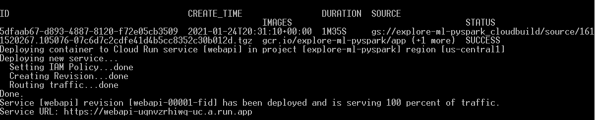
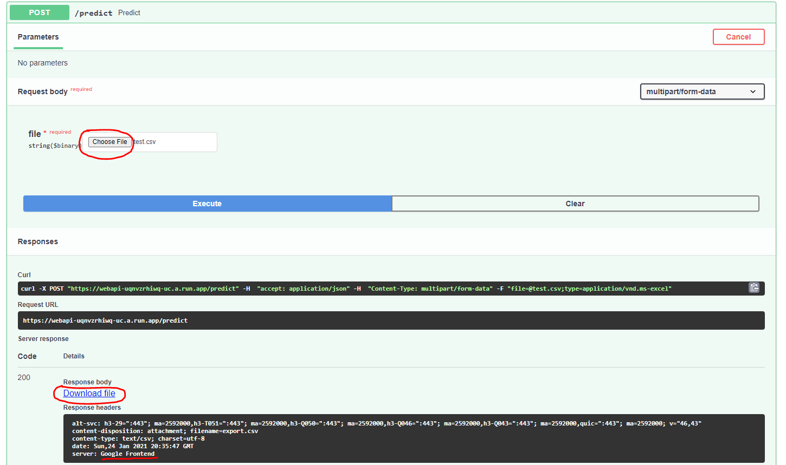

# Titanic dataset

Yes, famous dataset!  
Great opportunity to make a deep dive in feature engineering and supervised model training.  

## Notebook exploration  

I performed a full analysis and model training of this dataset, with two different ML packages: 

1.first a [scikit-learn notebook](./notebooks/titanic-scikit-learn.ipynb)  
2. then a full [pyspark notebook](./notebooks/titanic-pyspark.ipynb) as a preparation work for a run on gcp cloud platform

In both cases, I opted for a majority vote ensemble of fitted classifiers : { Random Forest, Gradient Boosted Tree, MultiLayer Perceptron}

## Running the model in the cloud on a spark cluster  

Once I finalized the pyspark analysis, I ran it on a Spark/hadoop cluster on a google dataproc cluster.

The below scripts will:  
(assuming that a gcp project_id 'explore-ml-pyspark' exists with billing enabled)  
- deploy the train/test datasets in google storage
- create a dataproc cluster of N workers using a preview image [Python 3.8, Miniconda3 4.9.0, Spark 3.0.1]
- set "protective" criteria of shutdown cluster (max-idle/max-age) to avoid cloud money waste
- launch the spark job, that is the training of the majority vote ensemble followed by the prediction of the test set stored in gs
- deletion of the cluster


```powershell
.\scripts\titanic_pyspark_gcp_dataproc.ps1 `
-projectId "explore-ml-pyspark" `
-region "us-central1" `
-bucket "gs://explore-ml-files" ` 
-trainDatasetLocalPath .\data\train.csv `
-testDatasetLocalPath .\data\test.csv `
-cluster "pyspark-test" ` 
-scriptPath .\scripts\run_pyspark_titanic.py ` 
-modulePaths .\scripts\titanicVotingClassifier.py ` 
-hyperparameterTuning $true 
``` 

## Deploying a webapi to predict Titanic survivals

Deploying a trained model in a web api is often a mandatory key to launch the the industrialization step.  
Here I went through the deployment of a Titanic classifier (Gradient Boosted Tree) using FastAPI module and a uvicorn web server.   

I packaged the api in a docker image and ran it in gcp Cloud Run. 

Here is the script that triggers the image compilation and run:

```powershell
gcloud builds submit --tag gcr.io/explore-ml-pyspark/app --timeout=20m

gcloud run deploy webapi --image gcr.io/explore-ml-pyspark/app --platform managed --region us-central1 --allow-unauthenticated
``` 

Once run, the gcloud deploy command displays the service url:



Suffixing this url with /docs allow us to get to the Swagger UI and play with the model.  
In the below snapshot, we can see that the /predict route allows us to upload a csv file and run a prediction which is stored in a downloadable csv file: 




